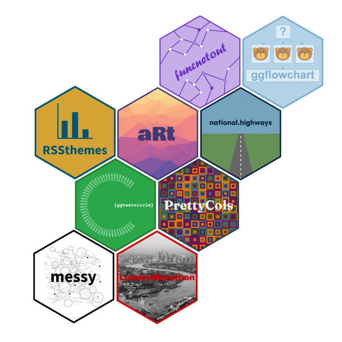
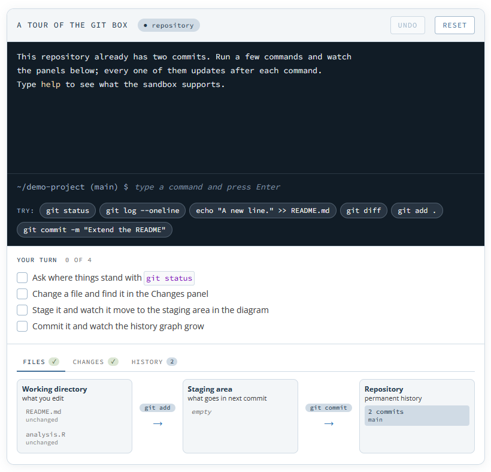
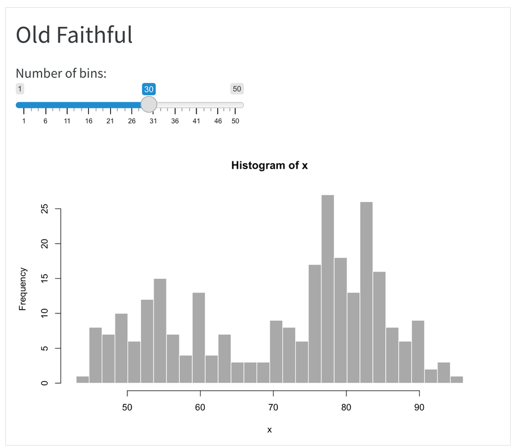
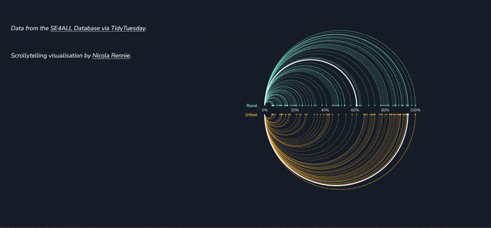



## About me

::: columns
::: {.column width="60%"}

Data visualisation specialist, mainly using R, Python, and D3.

<br>

Background in statistics, operational research, and data science.

<br>

Author of several R packages (mainly for visualisation).

<br>

Co-author of Royal Statistical Society's *Best Practices for Data Visualisation* guidance.

:::

::: {.column width="40%"}

{fig-align="center" fig-alt="Grid of R package hex logos" width=100%}

:::

:::


# Editable code {background-color="#FFFFFF" background-image="assets/img/bg-light-min.png" .up} 

## Static code blocks

```{{r}}
plot(mtcars$mpg, mtcars$wt)
```

<br>

::: {.fragment}

```{r}
plot(mtcars$mpg, mtcars$wt)
```

:::

## Interactive R code blocks

```{webr}
plot(mtcars$mpg, mtcars$wt)
```

## A little bit of webR magic

```{{webr}}
plot(mtcars$mpg, mtcars$wt)
```

<br>

::: {.fragment}

* Run R code directly in a browser
* No R installation or server required
* Try it at [webr.sh](https://webr.sh/)

:::

## Interactive Python code blocks

```{{pyodide}}
2 + 2
```

<br>

::: {.fragment}

* Both R and Python live code work through Quarto Live extension
* Interface very similar for both
* Pre-install packages 

:::

## Interactive git commands

::: columns

::: {.column width="40%"}

* A `git-sandbox` block in your Quarto document becomes a real Git repository running in a browser
* Nothing is installed and nothing leaves the page. 
* Disappears on reload, so learners cannot break anything.
* [ryjohnson09.github.io/quarto-git-sandbox](https://ryjohnson09.github.io/quarto-git-sandbox/)

:::

::: {.column width="60%"}

{fig-align="center" fig-alt="Screenshot of git sandbox" width=80%}

:::

:::


# Interactive charts {background-color="#FFFFFF" background-image="assets/img/bg-light-min.png" .up} 

## Interactive charts in Quarto {background-image="images/interactive.jpg" background-position="right" background-size="600px"} 

::: columns

::: {.column}

* Put a {Shiny} app inside a Quarto document (requires a Shiny server)
* Put a Shinylive app inside a Quarto document (webR / Pyodide magic)
* Use Observable `{ojs}` code blocks
* Add some HTML/CSS/JavaScript magic (not as tricky as it sounds!)

:::

:::

## Shiny Quarto documents

````
---
title: "Old Faithful"
format: html
server: shiny
---

```{{r}}
sliderInput("bins", "Number of bins:", 
            min = 1, max = 50, value = 30)
plotOutput("distPlot")
```

```{{r}}
#| context: server
output$distPlot <- renderPlot({
  x <- faithful[, 2]  # Old Faithful Geyser data
  bins <- seq(min(x), max(x), length.out = input$bins + 1)
  hist(x, breaks = bins, col = 'darkgray', border = 'white')
})
```

````

## Shiny Quarto Documents

{fig-align="center" fig-alt="Screenshot of Shiny app" width=60%}


## Shiny Quarto documents {background-image="images/deploy.jpg" background-position="right" background-size="600px"} 

::: columns

::: {.column}

* Deploy Quarto documents with Shiny apps as you would normally deploy a Shiny app
* Or use the `shinylive` Quarto extension to run in a web browser (using webR or Pyodide)
* Both R and Python versions of `shinylive` available

:::

:::

## `htmlwidgets` + `HTMLtools`

Add a dropdown:

```{r}
#| warning: false
library(htmltools)
options_vec <- unique(ggplot2::diamonds$cut)
names(options_vec) <- options_vec

dropdown_html <- tags$div(
  tags$select(
    id = "dropdown",
    lapply(
      names(options_vec),
      function(name) {
        tags$option(
          value =
            options_vec[[name]],
          name
        )
      }
    )
  )
)
```

## `htmlwidgets` + `HTMLtools`

```{r}
dropdown_html
```

## Connecting to `htmlwidgets`

```{r}
library(ggiraph)
library(ggplot2)
g_int <- ggplot() +
  geom_point_interactive(
    data = diamonds,
    mapping = aes(x = carat, y = price, colour = cut,
                  data_id = cut, tooltip = paste0("$", price))
  )
g_girafe <- girafe(ggobj = g_int, height_svg = 4.5)
```

## Connecting to `htmlwidgets`


```{r}
#| output-location: slide
browsable(
  tagList(
    dropdown_html,
    g_girafe,
    tags$script(HTML("
      function filterByDropdown(selected) {
        document.querySelectorAll('[data-id]').forEach(el => {
          if (el.getAttribute('data-id') === selected) {
            el.setAttribute('style', 'display:block;');
          } else {
            el.setAttribute('style', 'display:none;');
          }
        });
      }

      document.getElementById('dropdown').addEventListener('change', function() {
        filterByDropdown(this.value);
      });

      // Run on initial load to filter by default selection
      document.addEventListener('DOMContentLoaded', function() {
        const initialSelected = document.getElementById('dropdown').value;
        filterByDropdown(initialSelected);
      });
    "))
  )
)
```

# Alternative output types {background-color="#FFFFFF" background-image="assets/img/bg-light-min.png" .up} 

## Carousels

<br>

```carousel


```

## Carousels

<br>

````
```carousel


```
````

## Scrollytelling {background-color="#151C28"}

{fig-align="center" fig-alt="Screen recording of scrolly gif" width=100%}

## Scrollytelling

````
---
title: My First Closeread
format: closeread-html
---

Hello World! Please read my Closeread story below.

:::{.cr-section}

Closeread enables scrollytelling.

Draw your readers attention with focus effects. @cr-features

:::{#cr-features}
1. Highlighting
2. Zooming
3. Panning
:::

:::
````


## {data-menu-title="ggplot2 battles"}



[`ggplot2` battles by Michael Lydeamore](https://www.ggplotbattles.dev/)

## Resources {background-image="images/resources.jpg" background-position="right" background-size="600px"} 

::: columns

::: {.column}

* Quarto documentation: [quarto.org](https://quarto.org/)

* Awesome Quarto list: [github.com/mcanouil/awesome-quarto](https://github.com/mcanouil/awesome-quarto)

* Quarto extensions: [m.canouil.dev/quarto-extensions](https://m.canouil.dev/quarto-extensions/)

* Quarto Live: [https://r-wasm.github.io/quarto-live/](https://github.com/r-wasm/quarto-live): 

* Closeread scrollytelling: [closeread.dev](https://closeread.dev/)

:::

:::

# nrennie.rbind.io/rss-2026-quarto {background-color="#151C28" background-image="assets/img/bg-min.png" .up} 


